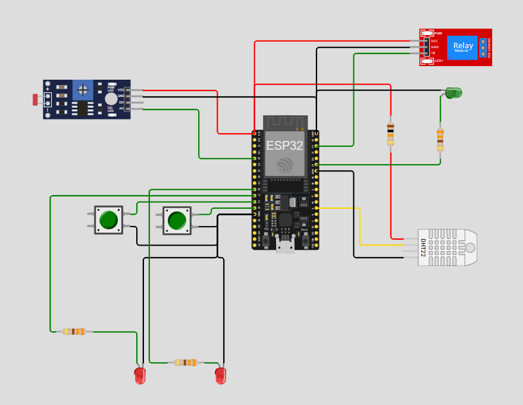

# FIAP - Faculdade de Informática e Administração Paulista

 

# Sistema Inteligente de Monitoramento Agrícola com ESP32

## Integrantes: 
- <a href="https://www.linkedin.com/in/joseandrefilho">Jose Andre Filho</a>

## Professores:
### Tutor(a) 
- <a href="https://www.linkedin.com/in/lucas-gomes-moreira-15a8452a/">Lucas Gomes Moreira</a>
### Coordenador(a)
- <a href="https://www.linkedin.com/in/profandregodoi/">André Godoi Chiovato</a>

## Objetivo do Projeto

O projeto **FarmTech Solutions** visa desenvolver um sistema de monitoramento e controle inteligente para a irrigação e o manejo de culturas agrícolas, utilizando um **ESP32** e sensores simulados no ambiente [Wokwi](https://wokwi.com/). Este sistema coleta dados ambientais relevantes — como umidade do solo, níveis de nutrientes (P e K) e valores de pH — permitindo decisões automatizadas e eficientes para o controle de irrigação e aplicação de fertilizantes, promovendo o uso otimizado de recursos.

### Importância do Projeto

Este sistema é projetado para promover a **gestão inteligente da água** em ambientes agrícolas, onde a irrigação eficiente é essencial. Ao ajustar automaticamente a irrigação com base nas condições reais do solo, o projeto contribui para uma agricultura sustentável e de precisão, resultando em economia de água e aumento da produtividade, especialmente em plantações de grande escala, como a cultura da cana-de-açúcar.

## Sensores e Componentes Utilizados

1. **DHT22 (Umidade e Temperatura)** - Conectado ao GPIO 4.
2. **LDR (Intensidade de Luz, representando pH)** - Conectado ao GPIO 32.
3. **Botões (Nutrientes P e K)** - Conectados a GPIOs específicos para simular dados de nutrientes.
4. **Relé (Controle de Irrigação)** - Conectado a um GPIO para ativar ou desativar a irrigação.

### Substituição de Sensores
- **Nutrientes P e K**: Em vez de sensores de nutrientes específicos, usamos dois botões, onde cada um representa a presença ou ausência do nutriente.
- **Sensor de pH**: Usamos um sensor de luminosidade (LDR) para simular o comportamento do pH, permitindo variar os valores em uma escala similar ao pH.

## Instruções de Configuração e Simulação

### Configuração do Circuito
1. No [Wokwi](https://wokwi.com/), crie um projeto com ESP32 e configure o circuito conforme descrito abaixo:
   - **DHT22** no GPIO 4 para dados de umidade e temperatura.
   - **LDR** no GPIO 32 para leitura de pH.
   - **Botões** em GPIOs específicos para nutrientes P e K.
   - **Relé** em um GPIO dedicado ao controle de irrigação.
2. Verifique o diagrama do circuito (`circuito_diagrama.png`) para detalhes de cada conexão.

### Carregar e Executar a Simulação
1. Insira o código `sketch.ino` no editor de código do Wokwi.
2. Inicie a simulação e abra o Monitor Serial para visualizar as leituras dos sensores e o controle de irrigação.
3. Teste os botões para simular diferentes níveis de nutrientes e ajuste as leituras do LDR para representar variações no pH.

- **Bibliotecas necessárias:** `DHT sensor library`, `PubSubClient` (instaláveis via IDE Arduino).

### Diagrama do Circuito
O diagrama abaixo ilustra todas as conexões no circuito, orientando a configuração exata de cada sensor e componente para a simulação.

## Testes e Verificação
- **Verificação de Dados no Monitor Serial**: Acompanhe o fluxo de dados para confirmar leituras precisas dos sensores e o acionamento do relé.
- **Simulação de Condições**: Ajuste os sensores para simular diferentes condições de solo e verificar como o sistema responde em tempo real.
- **Integração com MQTT e Banco de Dados**: Verifique o envio e armazenamento de dados via MQTT para o sistema Python e confirme a persistência no banco de dados Oracle.

Esse projeto oferece uma solução prática para o monitoramento e controle inteligente da irrigação, promovendo a sustentabilidade e eficiência em ambientes agrícolas.

## Simule o projeto no Wokwi

Você pode visualizar e interagir com a simulação do projeto no Wokwi clicando [aqui](https://wokwi.com/projects/413777804461865985).
